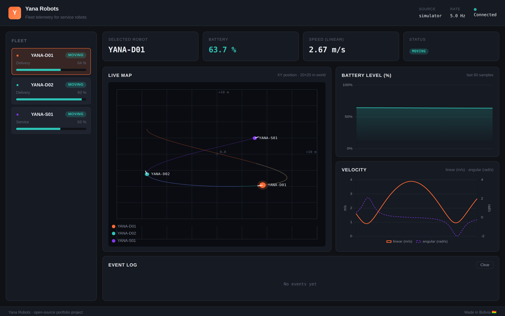
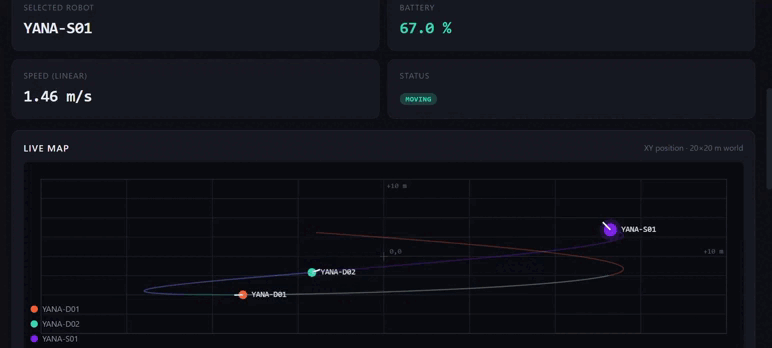
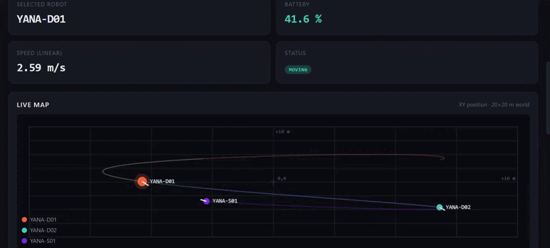
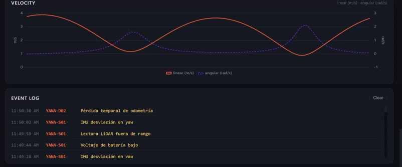
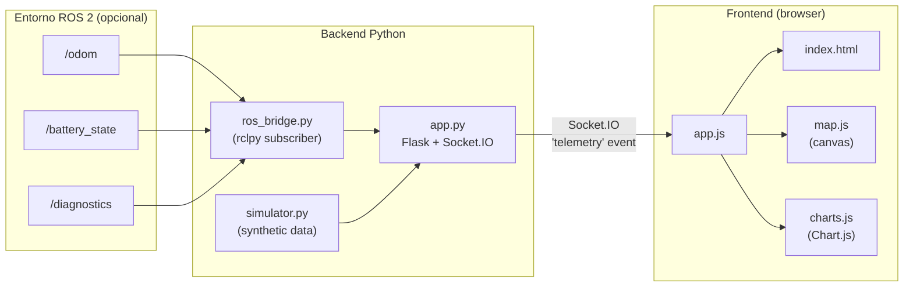

# Yana Robots

> **Dashboard web de telemetría en tiempo real para flotas de robots móviles ROS 2.**
> Backend Flask + Socket.IO con bridge a ROS 2 (rclpy). Frontend liviano con Chart.js, mapa 2D en canvas y log de eventos. Incluye un simulador para probar el sistema sin necesidad de tener ROS 2 instalado.

[](https://www.python.org/)
[](https://flask.palletsprojects.com/)
[](https://docs.ros.org/en/humble/)
[](Dockerfile)
[](LICENSE)

## 📸 Capturas y demo



<table>
  <tr>
    <td></td>
    <td></td>
    <td></td>
  </tr>
  <tr>
    <td align="center"><b>Mapa 2D con trails YANA-S01</b></td>
    <td align="center"><b>Mapa 2D con trails YANA-D01</b></td>
    <td align="center"><b>Gráficos de velocidad</b></td>
  </tr>
</table>

> 🌎 **Sobre el nombre.** *Yana* viene del quechua **yanapakuy** — *servir, ayudar*. Captura exactamente lo que hacen los robots de servicio: entregar, atender y asistir. Le da identidad nacional a un proyecto pensado para flotas de robots en operación.

---

## Tabla de contenidos

1. [Motivación](#motivación)
2. [Características](#características)
3. [Arquitectura](#arquitectura)
4. [Estructura del proyecto](#estructura-del-proyecto)
5. [Inicio rápido (modo simulador)](#inicio-rápido-modo-simulador)
6. [Despliegue con Docker](#despliegue-con-docker)
7. [Uso con ROS 2](#uso-con-ros-2-real)
8. [Configuración](#configuración)
9. [Referencia de la API](#referencia-de-la-api)
10. [Esquema de mensajes de telemetría](#esquema-de-mensajes-de-telemetría)
11. [Desarrollo y tests](#desarrollo-y-tests)
12. [Próximas mejoras](#próximas-mejoras)
13. [Licencia](#licencia)

---

## Motivación

Los robots móviles de servicio (delivery, mesero, recepción, etc.) suelen operar en flotas de varias unidades repartidas en distintos pisos y locales. Para los equipos de operación es crítico ver de un vistazo:

- Estado de batería de cada robot
- Posición y velocidad actual
- Errores y advertencias del sistema
- Tendencias en el tiempo (¿cuál se está descargando más rápido? ¿cuál tiene más fallas?)

**Yana Robots** es un dashboard liviano que se conecta a tópicos estándar de ROS 2 y los expone por una interfaz web accesible desde cualquier navegador, pensada como herramienta de soporte para flotas múltiples — un caso de uso similar a la telemetría 4G/5G de robots comerciales.

---

## Características

- **Tiempo real**: comunicación bidireccional vía Socket.IO (WebSockets con fallback a polling).
- **Modo simulador**: 3 robots virtuales que se mueven en una curva de Lissajous y descargan batería realísticamente. No requiere ROS 2 — útil para demos y desarrollo del frontend.
- **Modo ROS 2**: bridge en `rclpy` que se suscribe a `/odom`, `/battery_state` y `/diagnostics`.
- **Mapa 2D vivo** en `<canvas>` con trails de posición.
- **Gráficos de batería y velocidades** (lineal y angular) con Chart.js.
- **Log de eventos** con detección automática de cambios de estado y nuevos errores.
- **Multi-robot**: vista lateral con selección de robot activo y KPIs.
- **Sin dependencias CDN**: Socket.IO y Chart.js vendorizados en `static/js/vendor/`. Funciona offline una vez instalado.
- **API REST** auxiliar (`/api/health`, `/api/snapshot`).

---

## Arquitectura



El componente clave es que **simulador y bridge ROS 2 implementan el mismo contrato**: ambos llaman a `on_update(robots: list[dict])` cada N milisegundos. Por eso el resto del sistema (Flask, frontend) es agnóstico a la fuente y se puede cambiar con una variable de entorno.

---

## Estructura del proyecto

```
yana-robots/
├── .github/workflows/ci.yml   # Tests + Docker smoke build en cada push
├── app/
│   ├── __init__.py
│   ├── app.py                 # Flask app factory + Socket.IO
│   ├── config.py              # Configuración por env vars
│   ├── simulator.py           # Simulador (no requiere ROS 2)
│   └── ros_bridge.py          # Suscriptor ROS 2 (lazy import de rclpy)
├── templates/
│   └── index.html             # Dashboard (single-page)
├── static/
│   ├── css/style.css
│   ├── js/
│   │   ├── app.js             # Lógica de UI + WebSocket client
│   │   ├── charts.js          # Wrappers Chart.js
│   │   ├── map.js             # Mapa 2D en canvas
│   │   └── vendor/            # Socket.IO + Chart.js (offline)
│   └── img/favicon.svg
├── ros2_test_publisher/
│   ├── telemetry_publisher.py # Robot ROS 2 sintético para pruebas E2E
│   └── README.md
├── tests/test_simulator.py    # Suite pytest
├── docs/
│   ├── architecture.md
│   └── images/dashboard.png
├── scripts/quickstart.sh
├── Dockerfile                 # Multi-stage, non-root, healthcheck
├── docker-compose.yml
├── Makefile                   # make run | test | docker-build | …
├── .env.example
├── run.py                     # Punto de entrada
├── requirements.txt
├── LICENSE
└── README.md
```

---

## Inicio rápido (modo simulador)

> Probado en Python 3.10+ en Linux y macOS.

```bash
# 1. Clonar
git clone https://github.com/<tu-usuario>/yana-robots.git
cd yana-robots

# 2. (Recomendado) crear entorno virtual
python -m venv .venv
source .venv/bin/activate    # Windows: .venv\Scripts\activate

# 3. Instalar dependencias
pip install -r requirements.txt

# 4. Ejecutar
python run.py
```

Abrir [http://localhost:5000](http://localhost:5000) en cualquier navegador. Se debe poder ver los 3 robots simulados (`YANA-D01`, `YANA-D02`, `YANA-S01`) moviéndose en el mapa.

> 💡 **Atajo con `make`**: si tienes `make` instalado, basta con `make install && make run`. Ejecuta `make help` para ver todos los targets disponibles.

---

## Despliegue con Docker

El proyecto incluye un `Dockerfile` multi-stage (imagen final ~150 MB, usuario no-root, healthcheck integrado) y un `docker-compose.yml` listo para usar:

```bash
# Levantar
docker compose up -d

# Ver logs
docker compose logs -f

# Detener
docker compose down
```

El servicio queda disponible en `http://localhost:5000`. Para personalizar configuración:

```bash
cp .env.example .env
# edita .env con tus valores
docker compose up -d
```

Para construir la imagen sin compose:

```bash
docker build -t yana-robots:latest .
docker run -d -p 5000:5000 --name yr yana-robots:latest
```

---

## Uso con ROS 2

### Opción A — Robot real

En una terminal con ROS 2 sourced:

```bash
source /opt/ros/humble/setup.bash   # ajusta a tu distro
TELEMETRY_SOURCE=ros2 python run.py
```

El dashboard ahora se suscribirá a `/odom`, `/battery_state` y `/diagnostics`. El robot debe estar publicando en esos tópicos. 

### Opción B — Robot simulado en ROS 2

Para hacer una prueba E2E sin hardware:

```bash
# Terminal 1 - publisher sintético
source /opt/ros/humble/setup.bash
python3 ros2_test_publisher/telemetry_publisher.py

# Terminal 2 - dashboard
source /opt/ros/humble/setup.bash
TELEMETRY_SOURCE=ros2 python run.py
```

---

## Configuración

Todas las opciones se controlan por variables de entorno (`.env` opcional):

| Variable           | Default      | Descripción                                       |
|--------------------|--------------|---------------------------------------------------|
| `TELEMETRY_SOURCE` | `simulator`  | Fuente de datos: `simulator` o `ros2`.            |
| `UPDATE_HZ`        | `5`          | Frecuencia de broadcast a clientes (Hz).          |
| `HOST`             | `0.0.0.0`    | Host de Flask.                                    |
| `PORT`             | `5000`       | Puerto del servidor.                              |
| `FLASK_DEBUG`      | `0`          | `1` para activar reload + debug.                  |
| `ROS_DOMAIN_ID`    | `0`          | (Solo modo ROS 2) `ROS_DOMAIN_ID` a usar.         |
| `SECRET_KEY`       | dev          | Llave de sesiones Flask (cambiar en producción).  |

---

## Referencia de la API

| Método | Endpoint        | Descripción                                                |
|--------|-----------------|------------------------------------------------------------|
| GET    | `/`             | Renderiza el dashboard.                                    |
| GET    | `/api/health`   | Health check JSON: `{status, source, update_hz}`.          |
| GET    | `/api/snapshot` | Último snapshot conocido de toda la flota.                 |

### Eventos Socket.IO

| Evento       | Dirección | Payload                       | Descripción                        |
|--------------|-----------|-------------------------------|------------------------------------|
| `connect`    | C → S     | —                             | Cliente se conecta.                |
| `telemetry`  | S → C     | `{ robots: TelemetryMsg[] }`  | Snapshot enviado a `UPDATE_HZ`.    |
| `disconnect` | C → S     | —                             | Cliente se desconecta.             |

---

## Esquema de mensajes de telemetría

```jsonc
{
  "robot_id":  "YANA-D01",
  "model":     "Delivery",
  "color":     "#FF6B35",
  "timestamp": "2025-11-08T01:24:00Z",
  "pose": {
    "x":     6.49,    // meters, world frame
    "y":     3.53,
    "theta": 1.57     // radians, yaw
  },
  "velocity": {
    "linear":  1.64,  // m/s
    "angular": 0.32   // rad/s
  },
  "battery": {
    "level":    70.7, // 0-100 %
    "voltage":  12.13,
    "charging": false
  },
  "status": "moving",  // idle | moving | charging | warning | error
  "errors": []
}
```

El bridge ROS 2 mapea automáticamente los campos:

| Tópico ROS 2       | Mensaje                            | Campos derivados                  |
|--------------------|------------------------------------|-----------------------------------|
| `/odom`            | `nav_msgs/Odometry`                | `pose`, `velocity`, `status`      |
| `/battery_state`   | `sensor_msgs/BatteryState`         | `battery.*`                       |
| `/diagnostics`     | `diagnostic_msgs/DiagnosticArray`  | `errors`, `status` (si WARN/ERR)  |

---

## Desarrollo y tests

```bash
# Tests
make test                   # o: pytest tests/ -v

# Linter
make lint                   # o: ruff check app/ tests/

# Limpiar caches
make clean
```

El proyecto incluye un workflow de **GitHub Actions** (`.github/workflows/ci.yml`) que en cada push corre:

1. Tests con pytest sobre Python 3.10, 3.11 y 3.12.
2. Lint con [ruff](https://docs.astral.sh/ruff/).
3. Build de la imagen Docker + smoke test del endpoint `/api/health`.

---

## Próximas mejoras

- [ ] Persistencia de telemetría a SQLite/InfluxDB para análisis histórico.
- [ ] Soporte multi-robot real con namespaces ROS 2 (`/robot1/odom`, `/robot2/odom`).
- [ ] Autenticación y multi-tenant (cada operador ve solo su flota).
- [ ] Alertas push (Telegram / WhatsApp) cuando la batería cae bajo un umbral.
- [ ] Grabación de "viajes" reproducibles (tipo rosbag pero web-friendly).
- [ ] Despliegue con Docker Compose extendido (Flask + Nginx + ROS 2).

---

## Sobre este proyecto

Construido como pieza de portafolio orientada a roles de **robótica móvil y sistemas embebidos**, demostrando:

- Integración hardware ↔ software ↔ web en una sola pieza coherente.
- Buenas prácticas de Python (factory pattern, threading, tipado).
- Frontend liviano sin frameworks pesados.
- Pensamiento sobre operaciones reales: telemetría, alertas, multi-robot.
- DevOps fundamentals: CI/CD, contenedores, healthchecks, secrets management.

Inspirado en el despliegue de flotas de robots de servicio.

---

## Licencia

Distribuido bajo la licencia MIT. Consulta [`LICENSE`](LICENSE) para más detalles.

---

**Autora:** Lucia Martinez Zuzunaga · [LinkedIn](https://www.linkedin.com/in/lucia-martinez-z96/) · [Portfolio](https://pdct.my.canva.site/lucia-martinez/)
